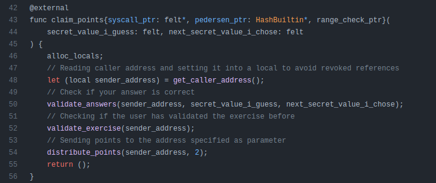

# StarkNet-Cairo-101

Este tutorial está creado con la finalidad de ayudar a nuevos usuarios y que tengan donde consultar en caso de que no puedan avanzar. La única forma de aprender sobre Cairo es ponerse manos a la obra.

### Como obtener los puntos

Revisar el código del contrato. Interactuar con el contrato a través de Voyager. Hacer foco en la función `claim_points()` y ver que tiene que pasar para que se ejecute correctamente.

### Token Cairo-101

Agrega el siguiente token en tu wallet ya sea [ArgentX](https://www.argent.xyz/argent-x/) o [Braavos](https://braavos.app/)
`token_address =  0x05C6B1379f1D4c8A4f5dB781A706b63a885f3f9570F7863629E99e2342ac344c`

### Índice

1. [Ejercicio 1](#ej1)
2. [Ejercicio 2](#ej2)
3. [Ejercicio 3](#ej3)
4. [Ejercicio 4](#ej4)
5. [Ejercicio 5](#ej5)
6. [Ejercicio 6](#ej6)
7. [Ejercicio 7](#ej7)
8. [Ejercicio 8](#ej8)
9. [Ejercicio 9](#ej9)
10. [Ejercicio 10](#ej10)
11. [Ejercicio 11](#ej11)
12. [Ejercicio 12](#ej12)
13. [Ejercicio 13](#ej13)
14. [Resultado](#result)

### Ejercicio 1 - Sintaxis general 

[Código](https://github.com/starknet-edu/starknet-cairo-101/blob/main/contracts/ex01.cairo)

[Voyager](https://goerli.voyager.online/contract/0x29e2801df18d7333da856467c79aa3eb305724db57f386e3456f85d66cbd58b)

En este ejercicio solo debemos llamar la función `claim_points()` para obtener los puntos.

Función `claim_points()`

---

### Ejercicio 2 - Variables de almacenamiento, getters, asserts 

[Código](https://github.com/starknet-edu/starknet-cairo-101/blob/main/contracts/ex02.cairo)

[Voyager](https://goerli.voyager.online/contract/0x18ef3fa8b5938a0059fa35ee6a04e314281a3e64724fe094c80e3720931f83f)

En este ejercicio debemos averiguar el valor de `my_secret_value_storage` para poder obtener los puntos.

Función `claim_points()`

Llamó a la función `my_secret_value()` y me guardo el valor.

Ingreso el valor obtenido en la función anterior. De esta manera ya puedo obtener los puntos.

---

### Ejercicio 3 - Leyendo y escribiendo variables de almacenamiento 

[Código](https://github.com/starknet-edu/starknet-cairo-101/blob/main/contracts/ex03.cairo)

[Voyager](https://goerli.voyager.online/contract/0x79275e734d50d7122ef37bb939220a44d0b1ad5d8e92be9cdb043d85ec85e24)

En este ejercicio debemos modificar la variable `user_counters_storage` con las funciones `incremen_counter()`(suma 2) y `decrement_counter()`(resta 1) para que sea igual a 7 y poder obtener los puntos.

Función `claim_points()`

Como ven la variable `user_counters_storage` tiene el valor de 0.

Llamamos a la función 4 veces para que `user_counters_storage()` tenga el valor de 8.

Llamamos a la función 1 vez para que `user_counters_storage()` tenga el valor de 7.

De esta manera ya puedo obtener los puntos.

---

### Ejercicio 4 - Mappings 

[Código](https://github.com/starknet-edu/starknet-cairo-101/blob/main/contracts/ex04.cairo)

[Voyager](https://goerli.voyager.online/contract/0x2cca27cae57e70721d0869327cee5cb58098af4c74c7d046ce69485cd061df1)

En este ejercicio debemos hacer que el valor `values_mapped_storage` sea igual a `expected_value + 32` .

Función `claim_points()`

Me asigno un slot.

Me fijo el valor del slot.

Llamó a la función `values_mapped()` y me guardo el valor.

Ingreso el valor obtenido en la función anterior pero le resto 32, ya que dentro de la función `claim_points()` le suman este valor. De esta manera ya puedo obtener los puntos.

---

### Ejercicio 5 - Visibilidad de variables 

[Código](https://github.com/starknet-edu/starknet-cairo-101/blob/main/contracts/ex05.cairo)

[Voyager](https://goerli.voyager.online/contract/0x399a3fdd57cad7ed2193bdbb00d84553cd449abbdfb62ccd4119eae96f827ad)

En este ejercicio debemos hacer que el valor `values_mapped_secret_storage` sea igual a `expected_value + 23` .

Función `claim_points()`

Me asigno un slot.

Me fijo el valor del slot.

Llamó a la función `users_values()` y me guardo el valor.

Como verán es 0. Debemos llamar a la función `copy_secret_value_yo_readable_mapping()` para que modifique el valor.

Llamó a la función `users_values()` y me guardo el valor.

Ingreso el valor obtenido en la función anterior pero le resto 23, ya que dentro de la función `claim_points()` le suman este valor. De esta manera ya puedo obtener los puntos.

---

### Ejercicio 6 - Visibilidad de funciones 

[Código](https://github.com/starknet-edu/starknet-cairo-101/blob/main/contracts/ex06.cairo)

[Voyager](https://goerli.voyager.online/contract/0x718ece7af4fb1d9c82f78b7a356910d8c2a8d47d4ac357db27e2c34c2424582)

Debemos averiguar el valor secreto en `values_mapped_secret_storage` .

Función `claim_points()`

Me asigno un slot.

Debemos llamar a función `external_handler_for_internal_function()` para que modifique el valor de `values_mapped_secret_storage` .

Llamó a la función `user_values()` y me guardo el valor.

Ingreso el valor obtenido en la función anterior. De esta manera ya puedo obtener los puntos.

---

### Ejercicio 7 - Comparando valores 

[Código](https://github.com/starknet-edu/starknet-cairo-101/blob/main/contracts/ex07.cairo)

[Voyager](https://goerli.voyager.online/contract/0x3a1ad1cde69c9e7b87d70d2ea910522640063ccfb4875c3e33665f6f41d354a)

Se deben ingresar 2 valores A y B que cumplan las siguientes condiciones:
- A ≠ 0
- B ≥ 0
- A ≠ B
- A ≤ 75
- 40 ≤ A ≤ 70
- B < 1

Función `claim_points()`

De esta manera ya puedo obtener los puntos.

---

### Ejercicio **8 - Recursiones nivel 1** 

[Código](https://github.com/starknet-edu/starknet-cairo-101/blob/main/contracts/ex08.cairo)

[Voyager](https://goerli.voyager.online/contract/0x15fa754c386aed6f0472674559b75358cde49db8b2aba8da31697c62001146c)

En este caso `user_values_storage(user_address, 10)` debe tener el valor `10` .

Función `claim_points()`

Vamos a revisar de que manera escribe la función `set_user_values()`.
Utiliza recursión para escribir sobre `user_values_storage`.
El `user_address` siempre es el mismo. El slot inicia en 0, el max es len del array.
Empieza a escribir los valores del array de izquierda a derecha en `user_values_storage`.
En este caso no importa los valores que ingrese en las posiciones 0-9 contando desde la izquierda, lo unico que nos interesa es que en la posicion 10 contando de la izquierda tenga el valor 10.

Para el array `[10, 9, 8, 7, 6, 5, 4, 3, 2, 1, 0]` quedaría de la siguiente manera.

Llamo a la función `set_user_values()` con esta solución.

De esta manera ya puedo obtener los puntos.

---

### Ejercicio **9 - Recursiones nivel 2** 

[Código](https://github.com/starknet-edu/starknet-cairo-101/blob/main/contracts/ex09.cairo)

[Voyager](https://goerli.voyager.online/contract/0x2b9fcc1cfcb1ddf4663c8e7ac48fc87f84c91a8c2b99414c646900bf7ef5549)

Hay que pasar un array de 4 elementos donde la suma de estos 4 sea igual a 50, pero mientras se hace la suma se tiene que cumplir una condición.
Como el ejercicio anterior empieza a iterar de izquierda a derecha.
La condición que se tiene que cumplir es que la `suma temporal * 2` tiene que ser menor o igual que la `suma temporal + el elemento actual` .

Función `claim_points()`

Función `get_sum_internal()`

Para el array `[33, 12, 4, 1]` quedaría de la siguiente manera.

De esta manera ya puedo obtener los puntos con la solución anterior.

---

### Ejercicio **10 - Composability** 

[Código](https://github.com/starknet-edu/starknet-cairo-101/blob/main/contracts/ex10.cairo)

[Voyager](https://goerli.voyager.online/contract/0x8415762f4b0b0f44e42ac1d103ac93c3ea94450a15bb65b99bbcc816a9388)

En este ejercicio el valor secreto está en otro contrato. Vamos a llamarlo contrato B. El contrato A es donde tenemos que ingresar el valor secreto.

Función `claim_points()`

Primero debemos encontrar el address del contrato B. Se obtiene del contrato A llamando a la función `ex10b_address()` .

Busco es el [contrato B](https://goerli.voyager.online/contract/0x070e27636818c69fb3e17451bd077c971524cb2a5a38e79b2d8a09034b7e1a9c) en Voyager. Llamo la función `secret_value()` y obtengo el valor secreto.

Voy al contrato A. Ingreso el valor secreto y de esta manera ya puedo obtener los puntos. 

---

### Ejercicio **11 - Importando funciones** 

[Código](https://github.com/starknet-edu/starknet-cairo-101/blob/main/contracts/ex11.cairo)

[Voyager](https://goerli.voyager.online/contract/0xab5577b9be8948d89dbdba63370a3de92e72a23c4cacaea38b3a74eec3a872)

Debemos chequear los import para saber donde se encuentra la función `validate_answers()` y ver su lógica.

Función `claim_points()`

Función `secret_value()`

Función `validate_answers()`

Llamo a la función `secret_value()` y obtengo el valor secreto.

Le resto 42069, ya que dentro de la función `secret_value()` suma ese valor y de esta manera ya puedo obtener los puntos.

---

### Ejercicio **12 - Eventos** 

[Código](https://github.com/starknet-edu/starknet-cairo-101/blob/main/contracts/ex12.cairo)

[Voyager](https://goerli.voyager.online/contract/0x24d15e02ddaa19d7ecd77204d35ed9bfff00a0cabc62eb3da5ba7680e44baf9)

Al llamar la función `assign_user_slot()` se emite un evento donde está el valor secreto.

Función `claim_points()`

Llamo la función `assign_user_slot()` y me quedo con el tx de la transacción para poder revisar los eventos.

Le resto 32, ya que cuando se emitió el evento le sumaron ese valor.

---

### Ejercicio **13 - Privacidad en StarkNet** 

[Código](https://github.com/starknet-edu/starknet-cairo-101/blob/main/contracts/ex13.cairo)

[Voyager](https://goerli.voyager.online/contract/0x2bae9190076c4252289b8a8671277cef57318192cff20c736808b0c71095895)

Función `claim_points()`

Me asigno un slot.

Me fijo el valor del slot.

Revisamos la [transacción](https://goerli.voyager.online/tx/0x6c2eafb7708f38a81c5a772d8d76ebf5a28fd27939df273a6650147e662c838) que se creó el contrato. Si vemos la transacción se ve el array por lo tanto los valores secretos. Al igual que los ejercicios anteriores al array lo iteran de izquierda a derecha. Por lo tanto el último el elemento del array se guarda en la posición 0.
Haciendo la siguiente resta podemos obtener el valor secreto:

valor secreto = len_array - user_slot 
valor secreto = 106 - 55 = posicion 51

Tx cuando se creo el contrato 

Tenemos que revisar *CONSTRUCTOR CALLDATA*

Buscamos la posicion y guardamos el valor.

De esta manera ya puedo obtener los puntos.

---

### Resultado 

